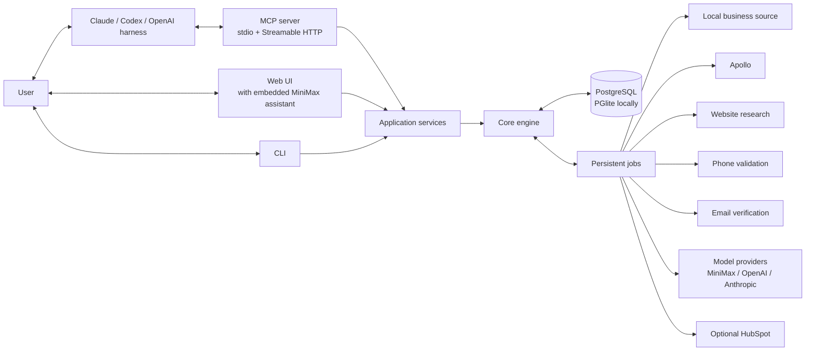

# System architecture

## Core decision: a headless engine with replaceable control surfaces

The headless lead engine is foundational. Claude Code, Codex, and OpenAI-compatible harnesses are the first beta interfaces, not the required permanent interface. The mature product is an approachable application for nontechnical users; a minimal web UI is expected at Milestone 2 and must call the same application services.

No control surface is the database or workflow runtime. The engine owns workflow definitions, persistence, provider calls, run progress, budgets, dedupe, and exports, and exposes deterministic services that every interface—harness, CLI, web UI, and embedded assistant—calls.



## One codebase, shared application services

1. **Engine library**: provider-neutral workflow definitions, validation, execution, state transitions, dedupe, scoring, approval enforcement, cost controls, and exports.
2. **Application services**: workflow management, run preview/start/status/results, provider orchestration, lead review, credential requirements, and usage accounting.
3. **Interface adapters** over those services:
   - **CLI**: deterministic local/admin operation and debugging.
   - **MCP server**: strict, model-neutral tools over stdio and Streamable HTTP transports.
   - **Web UI**: minimal guided application, expected at Milestone 2.
   - **Embedded assistant**: an optional model-backed helper (MiniMax first) that drafts workflows and explains previews through the same services.

No interface duplicates business logic or bypasses the application services; none is a separate product backend.

## Recommended repository structure

```text
src/
  engine/
    workflow-schema/         typed definitions and validation
    runner/                  execution, conditions, retries
    records/                 business/person/company lead model
    dedupe/                  stable identity rules
    scoring/                 reusable score templates
  app/                       application services shared by CLI, MCP, UI, and assistant
  providers/
    apollo/                  professional search/enrichment
    places/                  local-business discovery
    website/                 bounded public-site research
    phone-validation/        format, line type, and line-status adapters
    email-verification/      deliverability-status adapters
    models/                  shared generation interface
      minimax/               MiniMax structured generation (first embedded provider)
      openai/                OpenAI structured generation
      anthropic/             Anthropic structured generation
    hubspot/                 optional export
  storage/                   PostgreSQL/PGlite repositories and migrations
  jobs/                      persistent background execution behind a JobQueue interface
  cli/                       commands and human-readable output
  mcp/                       model-neutral tools and transports
  web/                       minimal guided UI (Milestone 2)
```

## Workflow definition

```json
{
  "id": "local-service-leads",
  "version": 1,
  "name": "Local service business leads",
  "inputs": {
    "businessType": "roofing contractor",
    "locations": ["Austin, TX"],
    "limit": 50,
    "enrichmentProfile": "call_ready"
  },
  "steps": [
    { "id": "discover", "type": "source", "provider": "places" },
    { "id": "normalize", "type": "normalize" },
    { "id": "dedupe", "type": "dedupe" },
    { "id": "website", "type": "research", "provider": "website", "profiles": ["call_ready", "full"] },
    { "id": "apollo", "type": "enrich", "provider": "apollo", "optional": true, "profiles": ["call_ready", "full"] },
    { "id": "contact-check", "type": "enrich", "capability": "contact_validation", "profiles": ["call_ready", "full"] },
    { "id": "fit", "type": "score", "template": "local-service", "profiles": ["full"] },
    { "id": "copy", "type": "generate", "template": "agency-opener", "profiles": ["full"] },
    { "id": "review", "type": "review_gate" },
    { "id": "export", "type": "export", "format": "csv" }
  ]
}
```

The runner supports linear steps and simple conditions. A full arbitrary DAG is unnecessary initially. Workflow versions are immutable once used by a run.

`enrichmentProfile` is a run input validated against `quick_list`, `call_ready`, or `full`. The resolver shows exactly which optional steps the profile enables before issuing an approval token. Typed overrides can disable or strengthen individual contact-discovery and validation steps.

## Built-in workflows

### Local business

`Places/local source -> normalize -> dedupe -> website research -> optional Apollo enrichment -> local-business score -> personalize -> review -> export`

Google Places Text Search supports category/location queries and can include pure service-area businesses. Requested fields determine billing, and Places content has storage/attribution restrictions. The adapter must persist stable place identifiers and handle other content according to the current Google Maps Platform policies.

The public business phone returned by the source is stored as `business_main`, not assumed to be an owner's direct number. Quick List stops after permitted source fields, normalization, and dedupe. Call-Ready and Full may continue into person/contact discovery and validation after preview and approval.

Shortlist before expensive owner enrichment: source and score broadly, then continue only the approved best subset into paid owner/person discovery.

### Professional/executive

`Apollo people/company search -> preview -> approval -> enrich -> dedupe -> executive score -> personalize -> review -> export`

### Imported list

`CSV/domain/URL import -> normalize -> dedupe -> website research -> optional Apollo enrichment -> score -> personalize -> review -> export`

## Coverage strategy as agencies grow

The product does not select sources solely from company size. It routes from the campaign's available identifiers and targeting dimensions.

| Campaign shape | Primary discovery | Optional expansion |
|---|---|---|
| Local owner-operated businesses | Places/local-business provider | Website research, then Apollo when a company or person match is credible |
| Regional or multi-location SMBs | Local-business and Apollo company searches | Website research and decision-maker enrichment |
| National companies and executives | Apollo company/people search | Imported account lists, website research, and later additional provider adapters |
| Existing or client-supplied records | CSV/domain/URL import | Website and Apollo enrichment |

This lets an agency reuse the same engine as it moves from city-level prospecting to larger accounts across the United States. Coverage limits remain visible, and the engine can split a large market into bounded queries without pretending that one provider is complete.

## Simplified data model

| Table | Purpose |
|---|---|
| `users` | Operator identity. |
| `agencies` | Minimal owner/team boundary. |
| `workflows` | Workflow identity and editable draft. |
| `workflow_versions` | Immutable validated configuration. |
| `runs` | Version, inputs, approvals, state, counts, and budgets. |
| `approval_tokens` | Short-lived approval scope: workflow version, inputs, profile, overrides, record cap, budget, plan hash, and consumption state. |
| `run_items` | Per-lead step status, attempts, result references, and errors. |
| `run_item_steps` | Per-step attempt state, internal request key, provider request ID, and cost classification. |
| `leads` | Canonical business/person fields and stable identifiers. |
| `identity_conflicts` | Flagged conflicting identifiers held for operator resolution instead of automatic merges. |
| `contact_points` | Multiple phones/emails, their role, source, normalized value, and current best status. |
| `contact_point_checks` | Append-only validation method, provider result, confidence, and checked-at history. |
| `suppressions` | Entity-specific do-not-contact entries and operator review metadata. |
| `lead_sources` | Provider IDs, retrieval metadata, and permitted source snapshot. |
| `generated_outputs` | Score explanation, prompt version, evidence, and copy. |
| `exports` | CSV/CRM result and idempotency state. |

This remains a normal relational model. Do not build a generalized data warehouse. The full proposed schema in `docs/proposals/database-schema.md` is the target model; it remains proposed until the Milestone 0 vertical slice validates it.

PostgreSQL is the system of record. Local development can run the identical PG16-compatible DDL on embedded PGlite; hosted operation uses real PostgreSQL.

## Background execution

Persistent jobs handle retries, rate-limit handling, crash recovery, and scheduled continuation. pg-boss is the candidate queue: current pg-boss runs on PGlite via `fromPglite`, but that support is new, so Milestone 0 runs a bounded compatibility spike covering filesystem persistence, start/stop/restart, job recovery, retry/backoff, duplicate-claim prevention, cancellation, modest concurrency, and interaction with application transactions where supported. pg-boss stays behind a `JobQueue` interface and is adopted only after the spike passes. Queue job-delivery guarantees are distinct from third-party paid-call side effects.

## Idempotency and paid-provider safety

Internal idempotency is not provider-side idempotency. `run_item_steps.request_key` is the internal replay guard, not a universal credit-safety guarantee; the provider-side contract must be documented per adapter.

Every paid provider adapter documents:

- whether it accepts an idempotency key;
- whether it returns a stable request ID;
- whether ambiguous requests can be reconciled;
- whether failures consume credits;
- which errors are retryable;
- which outcomes require manual review.

The engine persists the internal request key, provider request ID, attempt number, attempt state, cost, provider response classification, and checked/reconciled time. If a request may have completed but the provider cannot confirm the outcome, the step is marked ambiguous and moves to `needs_review`; the engine never auto-retries a possibly-completed paid call.

## Identity strategy across market sizes

### Businesses

1. Provider business/place ID.
2. Normalized website domain.
3. Normalized business phone plus locality.

### People

1. Apollo person ID.
2. Normalized LinkedIn URL from an approved source.
3. Verified email.

Businesses without a known owner/contact remain valid business leads; contact enrichment is an optional later step, not a reason to discard them.

## Contact enrichment and call readiness

Contact enrichment is capability-based rather than hard-coded to one vendor:

1. **Discovery adapters** may find business phones, direct/mobile phones, named contacts, or emails.
2. **Validation adapters** independently assess phone format, line type, line status, identity association, or email deliverability.
3. **Policy rules** turn those signals into a transparent `ready`, `uncertain`, `invalid`, `suppressed`, or `unchecked` status for a particular campaign.

For example, Twilio Lookup can normalize and validate number format and optionally return line type or line-status intelligence, while Apollo can reveal or waterfall additional person-level phones and emails. Neither result alone guarantees that a human will answer or that a number belongs to the intended owner. The engine persists the exact check performed instead of reducing every result to `verified: true`.

The source waterfall stops when the campaign's acceptance rule is met—for example, a validated business main line for a local quick-call campaign, or a direct/mobile decision-maker number for an executive campaign. Duplicate results do not trigger repeated paid checks.

## Model-provider strategy

MiniMax M3 is the likely first embedded model provider (Milestone 5), behind the same shared generation interface as the OpenAI and Anthropic adapters. It serves natural-language-to-typed-workflow drafts, preview explanations, company/website summaries, fit rationale, cold-call notes, personalized openers, and configuration assistance.

No model provider—MiniMax included—may:

- call lead providers outside the application services;
- bypass cost preview or approval;
- write directly to the database;
- mark contact information verified;
- be the sole qualification authority;
- own run state;
- be required for deterministic sourcing and export.

The MCP client model, the embedded assistant model, and the workflow `generate` model are separate choices; none is architectural. A workflow with no configured model provider still sources, normalizes, dedupes, scores, and exports. All model outputs are validated against runtime schemas and grounded in persisted evidence; unsupported or uncertain claims are omitted or flagged.

## MCP boundary

The LLM harness receives narrow tools, not database access or raw provider credentials. Mutating/costly tools expose a preview/approval token.

Example flow:

1. `workflow_create` returns a validated draft.
2. `run_preview` returns sample leads, source limitations, and estimated costs.
3. User approves.
4. `run_start` accepts the approval token.
5. `run_status` and `run_results` read durable state.
6. `run_export_csv` exports reviewed results.

Tool inputs and outputs use strict JSON schemas. Read-only tools are annotated as read-only; tools that mutate state, spend credits, or export externally are annotated accordingly. The server initialization `instructions` must summarize the preview/approval sequence, cost limits, and prohibited outbound actions, with the most important guidance in the first 512 characters for Codex clients.

Harness approval and engine approval are separate protections. A client may prompt before invoking `run_start`, while the engine still rejects the call unless it contains a valid, unexpired approval token issued for the exact preview and budget.

The approval token also binds the enrichment profile and overrides. Changing from Quick List to Call-Ready, enabling a phone/email waterfall, or increasing the record cap invalidates the old token and requires a new preview.

## Harness and transport strategy

- **Local development and one-user operation**: start the MCP server through stdio.
- **Shared or remote operation**: expose the same server through authenticated Streamable HTTP.
- **OpenAI Responses hosted MCP**: consider only after there is a securely deployed, publicly reachable MCP endpoint.
- **Legacy SSE**: do not implement it for new work.

Claude Code, Codex, the OpenAI Agents SDK, the CLI, and the web UI all call the same application services. Model-specific SDKs are confined to generation adapters and the MCP adapter and never own run state.

## Credential handling

Secrets never appear in repository files, prompts, fixtures, screenshots, logs, CSV exports, or MCP responses.

- **DIY mode**: credentials stay inside the user's installation; environment/secret storage is documented; the user pays providers directly.
- **Managed mode**: credentials are encrypted per workspace, stored server-side only, write-only after entry, never exposed to the model or in support diagnostics, and rotatable/deletable.

The application reports whether a required provider is connected without exposing its secret.

## Deployment strategy

- **Local development**: PGlite where practical, fake providers, CLI, stdio MCP. No external credentials, no credit-consuming calls.
- **Personal VPS (Milestone 6)**: real PostgreSQL, background worker, application/API service, guided web UI, minimal authentication, encrypted credentials, backups, health monitoring, usage/cost accounting, and authenticated Streamable HTTP MCP. This deployment can become the managed beta environment.
- **Managed beta**: adds only workspace isolation, invited users, per-workspace secrets, usage and spending limits, backup verification, operational diagnostics, and basic support administration. No premature enterprise infrastructure.
- **DIY distribution**: after the hosted version is stable, evaluate documented Docker Compose, a one-command installer, and a packaged desktop application. Desktop packaging is not an early milestone.

## Safety and compliance baseline

- No LinkedIn scraping or automated LinkedIn actions.
- No Google Maps scraping; local-business data comes only from the official Places API or another approved provider.
- No consumer/patient targeting using health conditions or sensitive health data.
- Public-site research is rate-limited, respects robots/terms, and targets business pages only.
- Google Places integration follows current caching, storage, display, and attribution rules.
- Paid provider steps require an explicit approval gate.
- Provider credentials stay server-side and out of LLM prompts.
- LLM output is structured and grounded in saved evidence.
- Entity-specific suppression requests are durable and applied before every call-ready export.

## Official technical references

- [Apollo MCP](https://docs.apollo.io/docs/apollo-mcp)
- [Apollo People Search](https://docs.apollo.io/reference/people-api-search)
- [Apollo People Enrichment](https://docs.apollo.io/reference/people-enrichment)
- [Google Places Text Search](https://developers.google.com/maps/documentation/places/web-service/text-search)
- [Google Places fields](https://developers.google.com/maps/documentation/places/web-service/reference/rest/v1/places)
- [Google Places policies](https://developers.google.com/maps/documentation/places/web-service/policies)
- [LinkedIn API access](https://learn.microsoft.com/en-us/linkedin/shared/authentication/getting-access)
- [Anthropic MCP overview](https://docs.anthropic.com/en/docs/mcp)
- [OpenAI Codex MCP](https://developers.openai.com/codex/mcp)
- [OpenAI Agents SDK MCP](https://openai.github.io/openai-agents-js/guides/mcp/)
- [Clay Google Maps sourcing lesson](https://university.clay.com/lessons/finding-businesses-with-google-maps)
- [Clay enrichment run settings](https://university.clay.com/docs/enrichments)
- [Clay data waterfalls](https://university.clay.com/docs/building-a-data-waterfall)
- [Twilio Lookup](https://www.twilio.com/docs/lookup)
- [FTC telemarketing compliance guidance](https://www.ftc.gov/business-guidance/resources/complying-telemarketing-sales-rule)
