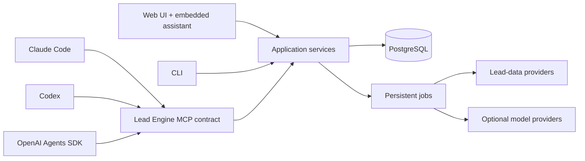

# LLM harness compatibility

## Goal

The lead engine is plug-and-play across Claude Code, Codex, OpenAI Agents SDK clients, future compatible clients, CLI automation, and the web UI. Claude Code, Codex, and OpenAI-compatible harnesses are the first beta interfaces, not the permanent required interface; the minimal web UI expected at Milestone 2 is a peer client of the same engine. The LLM is a replaceable control surface; it does not own workflows, leads, approvals, jobs, or exports.



The CLI, MCP server, web UI, and embedded AI assistant call the same application services. No business logic is duplicated between interfaces.

## Stable boundary

Every harness receives the same 12 MCP tools and strict JSON schemas:

- `workflow_create`
- `workflow_validate`
- `workflow_list`
- `run_preview`
- `run_start`
- `run_status`
- `run_cancel`
- `run_resume`
- `run_retry`
- `run_results`
- `lead_review_update`
- `run_export_csv`

`run_resume` and `run_retry` were added during M1 planning: without them a harness cannot continue a run past the review gate, lift a credit-cap pause (with a fresh approval token), or requeue failed items — the CLI could and the MCP contract must not be weaker.

Tool results use a consistent envelope containing `ok`, `data`, `summary`, `warnings`, `requestId`, and any permitted `nextActions`. Errors use machine-readable codes and retry guidance instead of prompt-specific prose.

The MCP server publishes concise initialization instructions covering the required preview -> approval -> start sequence, credit limits, and prohibited outbound actions. The first 512 characters contain the essential rules so Codex can use them while selecting tools.

## Transports

1. **Stdio first**: simplest path for local Claude Code, Codex, and OpenAI Agents SDK clients.
2. **Streamable HTTP second**: use the same handlers for authenticated remote or shared operation.
3. **Hosted MCP later**: an OpenAI Responses client may call a publicly reachable remote server after secure deployment.

Do not build legacy SSE transport. OpenAI's Agents SDK documentation recommends stdio or Streamable HTTP for new MCP integrations.

## MCP SDK policy

Use the current stable MCP TypeScript SDK v1.x line until the next major version is actually stable. Treat projected release dates as forecasts, not guarantees. Confine MCP SDK imports to the MCP adapter so an SDK major-version change cannot reach engine or application-service code.

## Client paths

| Harness | MVP connection | Later connection |
|---|---|---|
| Claude Code | Project MCP command over stdio | Authenticated Streamable HTTP |
| Codex desktop/CLI/IDE | Project `.codex/config.toml` over stdio | Authenticated Streamable HTTP |
| OpenAI Agents SDK | `MCPServerStdio` | `MCPServerStreamableHttp` or hosted MCP tool |
| Plain automation | CLI | Internal application API/job trigger |
| Web UI (Milestone 2) | Application services in-process | Hosted UI over the same services (Milestone 6) |

Codex supports project-scoped MCP configuration for trusted projects. The start commands exist and are contract-tested as of M1: `pnpm mcp:stdio` (stdio) and `pnpm mcp:http` (Streamable HTTP on `MCP_HTTP_PORT`, default 3001, optional `MCP_HTTP_TOKEN` bearer check). Both entries apply pending migrations idempotently at startup. The local Codex shape (substitute the absolute project path):

```toml
[mcp_servers.lead_engine]
command = "pnpm"
args = ["run", "mcp:stdio"]
cwd = "/absolute/path/to/project"
default_tools_approval_mode = "writes"
```

For Claude Code, the equivalent project-scoped entry in `.mcp.json` is:

```json
{
  "mcpServers": {
    "lead_engine": {
      "type": "stdio",
      "command": "pnpm",
      "args": ["run", "mcp:stdio"]
    }
  }
}
```

## Approval behavior

Approval is enforced at two levels:

1. The harness can ask the user before a mutating or costly MCP tool call.
2. The engine requires a signed, short-lived approval token tied to the preview, workflow version, record cap, provider actions, and estimated budget.

The second layer is mandatory because not every client applies approvals identically. `run_start` rejects missing, expired, changed, or already-consumed approvals.

The signed approval scope binds the workflow version, inputs, `enrichmentProfile`, phone/email capability overrides, record cap, budget, providers, estimated paid actions, and plan hash. A harness cannot reuse a Quick List approval to start Call-Ready enrichment; changing the profile, enabling a new waterfall, or raising the cap invalidates the token and requires a new preview.

## Model-provider independence

Three model choices are separate, and none is architectural:

1. The MCP client model — Claude, Codex, or an OpenAI agent driving the tools.
2. The embedded assistant model — likely MiniMax M3, arriving at Milestone 5 — which drafts workflows and explains previews inside the guided UI.
3. The `generate`-step model producing structured rationale and openers.

A user may control the engine through Claude while using an OpenAI model for a `generate` step, or through Codex while using Anthropic or MiniMax. All generation adapters (MiniMax, OpenAI, Anthropic) implement one shared interface and return the same evidence-grounded schema. The embedded assistant goes through the same application services as every other interface; it cannot bypass preview or approval, write directly to the database, mark contact information verified, or own run state.

A workflow with no configured model provider can still source, enrich, dedupe, score, review, and export leads. Only the optional `generate` step is skipped or held for configuration.

## Milestone 1 compatibility checks

- The same tool names, schemas, annotations, and results appear over stdio and Streamable HTTP.
- Claude Code, Codex, and an OpenAI Agents SDK fixture can list and call read-only tools.
- Each harness can preview and start a fake run without direct database access.
- Paid/mutating calls fail without an engine approval token even if the client attempts them.
- Closing one harness and reading the run from another returns the same durable state.
- No live model or lead-provider credentials are required for compatibility tests.

## Official references

- [OpenAI Codex MCP configuration](https://developers.openai.com/codex/mcp)
- [OpenAI Agents SDK MCP guide](https://openai.github.io/openai-agents-js/guides/mcp/)
- [Anthropic MCP documentation](https://docs.anthropic.com/en/docs/mcp)
